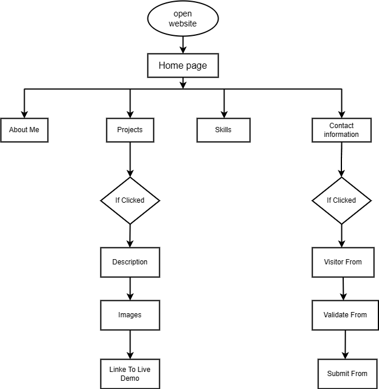

# Personal Portfolio Website 

Project Description My personal portfolio

## Project Objective

The objective of the capstone project is to create a web development portfolio that demonstrates my skills, projects, and accomplishments. This portfolio will serve as a showcase of my abilities and will be a valuable asset in my web development journey. By completing the capstone project, I will have a comprehensive portfolio that reflects my progress, expertise, and readiness to take on more challenging web development projects.

## Technologies 

- HTML 
- CSS 
- JavaScript
- Python
- Flask
- Git 

## How to run

First, you can start the local email server by running the following command:
```
python -m smtpd -c DebuggingServer -n localhost:1025
```
Then, you can start the flask server by running the following command:
```
python ./portfolio.py
```  
Finally, you can access the website on the following address:
```
http://127.0.0.1:5000/
```

## Contact Information

For more information use the contact below; 
- **Name**: Samar Emad 
- **Email**: samar.emad1259@gmail.com 

# Work flowChart #



